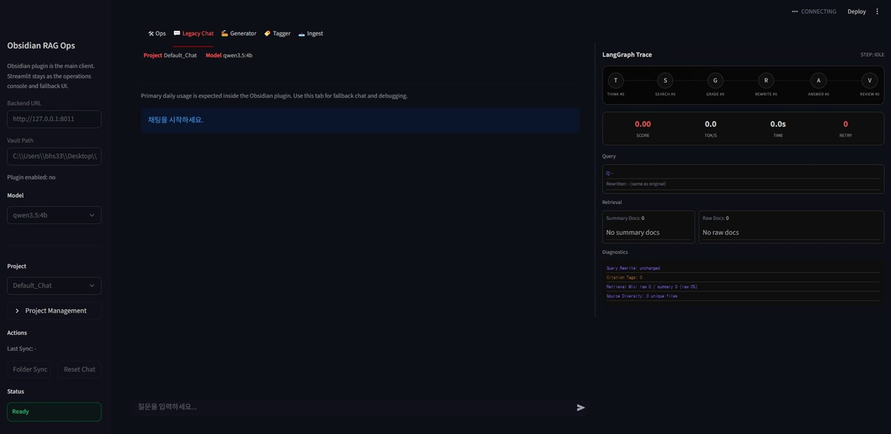
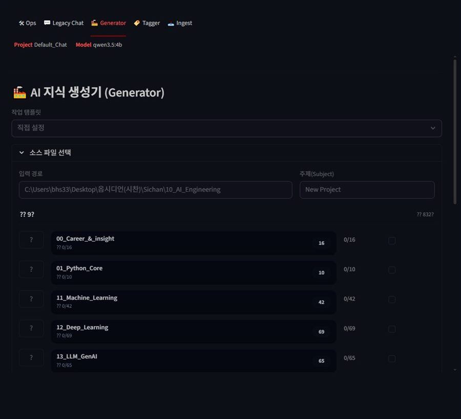
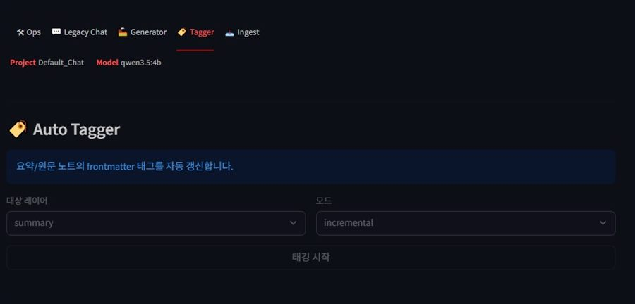
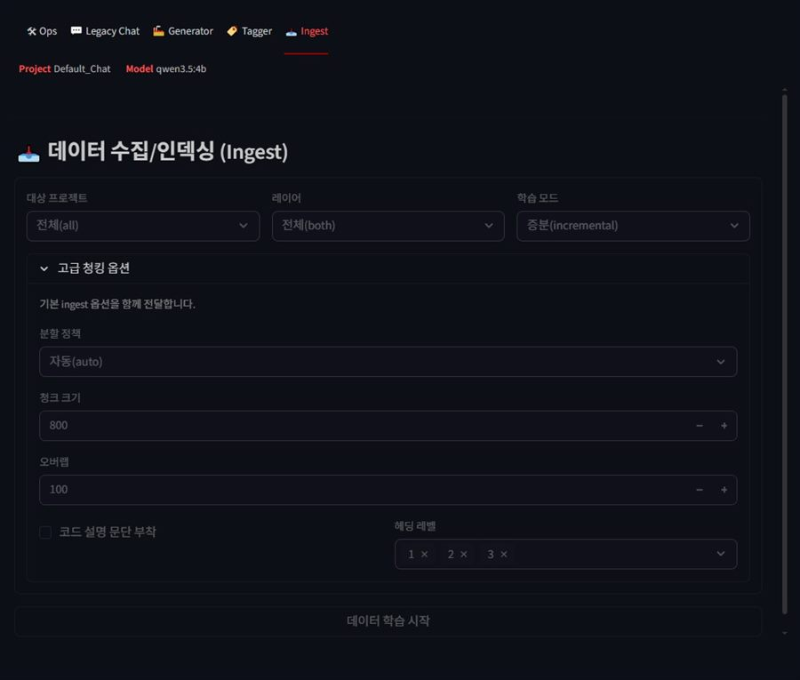

# Obsidian_RAG V1 - Streamlit-Centered Local RAG Chatbot

Obsidian 문서를 검색해 근거 기반 답변을 생성하는 로컬 RAG 시스템의 1차 버전입니다.
구성은 `FastAPI + Streamlit` 조합이며, Streamlit이 메인 사용자 인터페이스 역할을 담당합니다.

## V1 핵심 포인트

- Streamlit이 메인 채팅/운영 UI입니다.
- FastAPI `/api/chat/stream`으로 NDJSON 스트리밍 응답을 반환합니다.
- summary/raw 이중 저장소와 하이브리드 검색을 사용합니다.
- `start_rag.bat`로 백엔드와 프론트엔드를 함께 실행합니다.

## UI 스크린샷

### Streamlit 운영 화면

V1은 Streamlit이 메인 사용 화면이자 운영 콘솔 역할을 함께 맡았습니다.

<p align="center">
  
</p>

### Generator

지식 생성 워크플로우에서 소스 폴더와 주제를 선택하고 구조화 노트를 생성하던 화면입니다.

<p align="center">
  
</p>

### Tagger

요약/원문 노트의 frontmatter 태그를 자동 갱신하던 화면입니다.

<p align="center">
  
</p>

### Ingest

프로젝트 단위로 인덱스를 재구성하고 청킹 옵션을 제어하던 화면입니다.

<p align="center">
  
</p>

## 주요 기능

- `/api/chat/stream`에서 단계 로그와 답변을 스트리밍으로 반환
- 다중 질의 생성 후 하이브리드 검색으로 문서 후보 수집
- 검색 점수 기반 품질 게이트로 재작성/재검색 흐름 제어
- 답변 반복 패턴 감지 후 임계치에서 자동 절단
- 인용 태그가 없으면 출처 태그 자동 보강
- Streamlit에서 채팅, 인제스트, 태깅 작업 실행

## 아키텍처

```text
[User Query + Project + History]
  -> FastAPI /api/chat/stream
  -> AgenticFlow (Think -> Search -> Grade -> Rewrite -> Generate -> Review)
  -> RagEngine (Embedding Search + BM25 + RRF + Raw Expansion)
  -> LLM (Ollama / OpenAI)
  -> NDJSON Streaming Response
  -> Streamlit UI
```

## 기술 스택

### Backend
- Python 3.12
- FastAPI, Uvicorn
- Pydantic
- PyYAML, python-dotenv

### Frontend
- Streamlit
- httpx

### AI / RAG
- LangChain
- ChromaDB
- sentence-transformers / HuggingFace Embeddings
- BM25, RRF
- Ollama (`qwen2.5-coder:3b` 기본) / OpenAI Chat Models

### Infra / Tools
- Docker Compose
- GitHub Actions (`github/workflows/ci.yml`)

## 프로젝트 구조

```text
Obsidian_RAG/
|- backend/                    # FastAPI 서버와 RAG 핵심 로직
|  |- main.py                  # /health, /api/chat/*
|  |- config/                  # jobs.yaml, prompts.yaml, 경로/설정 로더
|  |- src/                     # graph, rag engine, pipeline, schema
|  `- tests/                   # 백엔드 테스트
|- frontend/                   # Streamlit 메인 UI
|  |- app.py
|  `- quality_dashboard.py
|- data/                       # 벡터 저장소, 로그, 데이터
|- projects/                   # 프로젝트별 채팅 이력
|- start_rag.bat
`- docker-compose.yml
```

## 설치 및 실행

### 사전 요구사항

- Python 3.12
- `pip`
- Ollama
- Obsidian 문서 경로

### 설치

```bash
git clone https://github.com/Sichanvisit/Obsidian_RAG.git
cd Obsidian_RAG

python -m venv .venv
# Windows
.\.venv\Scripts\activate

pip install -r backend/requirements.txt
pip install -r frontend/requirements.txt
```

### 환경변수 설정

```env
# Model / LLM
OPENAI_API_KEY=
LOCAL_LLM_URL=http://localhost:11434
LOCAL_LLM_MODEL=qwen2.5-coder:3b
EMBEDDING_MODEL_NAME=BAAI/bge-m3
LLM_TEMPERATURE=0.2

# Data paths
OBSIDIAN_PATH=
DATA_DIC_PATH=
DATA_SUMMATION_PATH=
OBSIDIAN_VAULT_PATH=

# Server
BACKEND_PORT=8010
BACKEND_URL=http://127.0.0.1:8010
ENABLE_STRATEGY_PLANNER=0
```

### 실행

#### 방법 1) Windows 일괄 실행

```bat
start_rag.bat
```

기본 포트는 Backend `8010`, Frontend `8502`입니다.

#### 방법 2) 수동 실행

```bash
# 1) Backend
python backend/main.py

# 2) Frontend
streamlit run frontend/app.py --server.port 8502
```

#### 방법 3) Docker Compose

```bash
docker compose up --build
```

## API

| Method | Endpoint | 설명 |
|:---:|:---|:---|
| `GET` | `/health` | 서버 및 엔진 준비 상태 조회 |
| `POST` | `/api/chat/stream` | 질의를 받아 NDJSON 스트리밍 응답 반환 |
| `POST` | `/api/chat/stop` | 세션 기준으로 스트리밍 생성 중단 |

## V1 요약

V1은 `Streamlit 중심 로컬 RAG 챗봇`으로서 파이프라인을 처음 제품 형태로 묶은 단계입니다.
핵심은 summary/raw 이중 저장소, 하이브리드 검색, Streamlit 메인 UI 정리였습니다.
