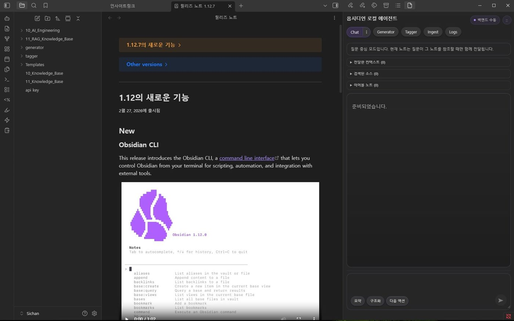
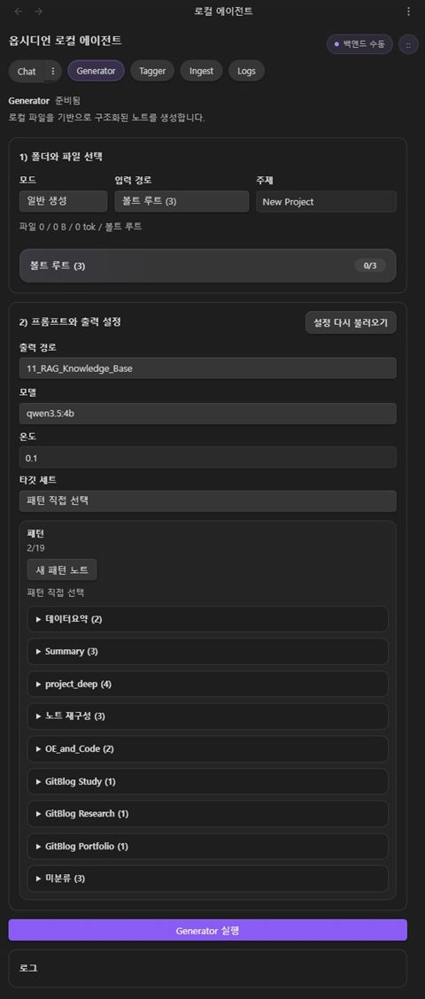
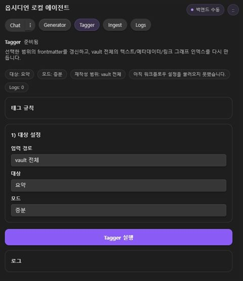
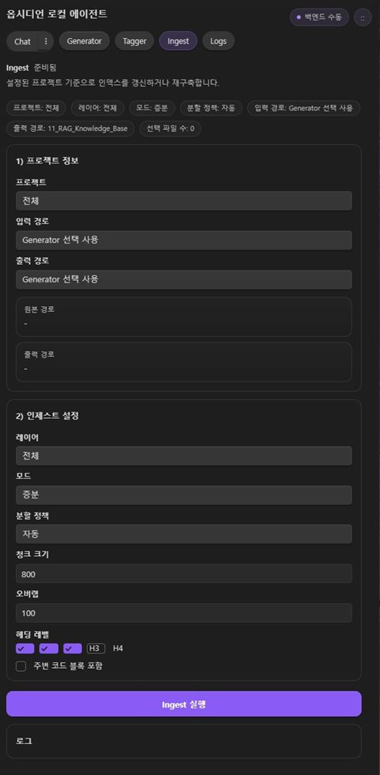
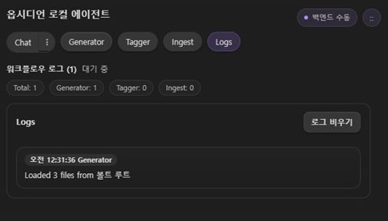

# Obsidian_RAG V2 - Obsidian Plugin 중심 로컬 지식 워크스페이스

> Obsidian 안에서 현재 노트 문맥, 관련 문서 검색, 생성/태깅/인덱싱 워크플로우를 함께 다룰 수 있도록 확장한 2차 버전입니다.

V1이 별도 Streamlit 콘솔에서 로컬 RAG를 구현했다면, V2는 실제 작업이 일어나는 Obsidian 안으로 검색과 워크플로우를 끌어오는 데 초점을 맞췄습니다.  
개인 프로젝트로 구조 설계, FastAPI 백엔드, Obsidian 플러그인, Streamlit 운영 콘솔, relation-aware retrieval, 테스트, 문서화를 직접 구현했습니다.

## 왜 이 버전을 만들었는가

이 버전은 "Obsidian 문서를 잘 찾아주는 챗봇"을 넘어서, 기록을 구조화하고 관계를 만들고 다음 행동까지 이어지는 로컬 지식 시스템을 만드는 것을 목표로 했습니다.

문제의식은 두 가지였습니다.

- Obsidian은 기록 저장에는 강하지만, 기록이 쌓인다고 자동으로 살아 있는 지식망이 되지는 않습니다.
- 일반적인 RAG는 문서를 많이 넣어도 관계 구조를 이해하지 못하면 검색과 답변이 쉽게 평면적인 유사도 검색에 머무릅니다.

그래서 이 프로젝트는 `문서 저장`보다 `구조화`, `유사도 검색`보다 `관계 기반 탐색`, `답변 생성`보다 `다음 행동으로 이어지는 워크플로우`에 더 무게를 두었습니다.

## 직접 구현한 범위

- Obsidian Plugin 기반 메인 클라이언트
- `/api/chat/obsidian/stream`와 도구용 스트리밍 APIs
- typed relation / related file 기반 relation-aware retrieval
- Generator, Tagger, Ingest 워크플로우
- Streamlit 운영 콘솔과 실행/헬스체크 스크립트

## 핵심 기술 스택

- Python 3.12, FastAPI, Pydantic
- TypeScript, Obsidian Plugin API, esbuild
- LangChain, ChromaDB, sentence-transformers
- BM25, RRF, relation-aware ranking, Ollama / OpenAI

## 프로젝트 개요

V1에서는 로컬 문서를 검색하고 응답하는 흐름을 만들었지만, 실제 지식 작업은 여전히 Obsidian 안에서 이루어졌습니다.  
V2의 목표는 이 분리를 줄이고, 현재 노트와 링크 구조를 활용해 검색 품질을 높이면서, 노트 생성·태깅·인덱싱까지 하나의 지식 워크스페이스로 묶는 것이었습니다.

## 어떤 지식과 아이디어를 적용했는가

### 1. Structured-first note understanding

이 프로젝트는 문서를 단순 텍스트 청크로만 다루지 않습니다.  
`note_type_auto`와 `doc_role_auto`를 분리해 "이 문서가 어떤 형식인가"와 "사고 흐름에서 어떤 역할인가"를 동시에 모델링했습니다.

예를 들어:

- `project-note + overview`
- `code-note + implementation`
- `review-note + review`
- `action-note + next_action`

같은 조합을 통해, retrieval과 recommendation이 단순 유사도가 아니라 문서 흐름을 이해하도록 설계했습니다.

### 2. Explainable typed relation schema

관련 문서를 그냥 비슷한 문서 목록으로 남기지 않고, `implements`, `review_of`, `next_action_for`, `decision_for`, `follow_up` 같은 typed relation으로 승격했습니다.

relation을 만들 때 사용한 신호는 다음과 같습니다.

- explicit wikilink
- related files / backlink
- same project / same root domain
- shared semantic tags / section keys / signal tokens
- `note_type_auto`, `doc_role_auto`

즉 relation은 단순 임베딩 유사도가 아니라, 문서 역할과 맥락을 반영한 설명 가능한 연결로 설계했습니다.

### 3. Relation chain runtime

Phase 2의 핵심은 relation metadata를 실제 런타임 관계망으로 승격하는 것이었습니다.  
이를 위해 relation graph runtime을 분리하고, adjacency 구성, 2-hop traversal, path scoring, relation path explanation을 구현했습니다.

이 체인은 다음 레이어에서 공통 기반으로 재사용됩니다.

- retrieval source expansion
- follow-up recommendation
- action generation
- lightweight graph panel

즉, 이 프로젝트는 graph를 "예쁜 시각화"가 아니라 검색·추천·행동 기능의 공유 인프라로 사용합니다.

### 4. Recommendation을 action-ready payload로 확장

추천 레이어는 "관련 문서 5개"를 던지는 데서 멈추지 않습니다.  
각 추천 항목에 대해 `recommendation_kind`, `priority_band`, `action_prompt`, `action_title`, `relation_path_text`, `hop_count`를 부여해 바로 다음 행동 흐름으로 이어질 수 있게 설계했습니다.

예:

- `next_step`
- `implementation`
- `review`
- `decision`
- `plan`
- `context`

이 설계 덕분에 recommendation payload는 plugin UI에서 설명 가능한 추천 카드이자 action engine의 입력으로 재사용됩니다.

### 5. Recommendation을 실제 행동 단위로 전환하는 Action Engine

Action Engine v1은 추천 결과를 바탕으로 `resume_next_step`, `continue_implementation`, `request_review`, `request_result`, `request_evidence` 같은 행동 단위를 생성합니다.

핵심은 두 가지였습니다.

- 현재 노트 역할과 질문 의도를 함께 반영할 것
- relation이 약하거나 비어 있을 때도 gap-detection rule로 보강할 것

이 구조를 통해 시스템은 단순히 "읽어볼 만한 노트"를 보여주는 것을 넘어서, 사용자가 바로 열고 실행할 수 있는 다음 행동까지 제안합니다.

### 6. Graph Layer를 시각 장식이 아니라 chain explanation UI로 설계

Graph Layer v1은 full canvas graph가 아니라 lightweight relation graph panel입니다.  
현재 질문에서 실제로 사용된 relation path만 짧은 chain 형태로 보여주고, 추천·액션·소스 패널과 같은 payload를 공유합니다.

즉 이 UI의 목적은 "복잡한 그래프를 그리는 것"이 아니라, 사용자가 `왜 이 노트가 연결되었는지`를 읽고 바로 탐색할 수 있게 만드는 데 있습니다.

## 무엇을 만들었는가

- Obsidian 플러그인을 메인 클라이언트로 두고, 현재 노트, 링크, 폴더, 태그, 백링크 문맥을 백엔드에 함께 전달할 수 있게 구성했습니다.
- `/api/chat/obsidian/stream`을 통해 일반 채팅과 구분된 Obsidian 전용 질의 흐름을 구현했습니다.
- typed relation과 related file 정보를 활용해 1-hop, 2-hop 확장을 수행하는 relation-aware retrieval을 추가했습니다.
- Generator, Tagger, Ingest를 개별 스트리밍 API로 분리해 대화 외 작업도 동일한 인프라로 처리하도록 설계했습니다.
- Streamlit은 메인 UI가 아니라 운영 콘솔과 fallback UI로 재정의했습니다.
- `start_rag.bat`와 health check 흐름을 보강해 로컬 환경에서 재기동과 재사용이 가능하도록 정리했습니다.

## 지식 처리 / LLM 활용 방식

이 버전에서는 LLM을 단순 채팅 응답기가 아니라, 현재 노트 문맥과 검색 결과를 결합해 지식을 재구성하는 레이어로 사용했습니다.  
질문이 들어오면 현재 노트와 관련 문서의 구조적 맥락을 함께 수집하고, hybrid retrieval과 relation expansion으로 후보를 보강한 뒤, 생성 단계에서 `sources`와 `retrieval_reason`까지 추적 가능하도록 설계했습니다.  
또한 LLM을 채팅에만 쓰지 않고, Generator/Tagger/Ingest 워크플로우와 연결해 노트 생성, metadata 갱신, 인덱스 재구성 같은 작업 흐름으로 확장했습니다.

## 현재까지의 검증과 수용 결과

현재 구현은 아이디어 수준에 머물지 않도록 phase 문서와 acceptance 기준으로 관리했습니다.

- Phase 2 관계망 엔진은 공식 종료 가능 상태로 판정되었습니다.
- relation graph runtime, recommendation payload, action engine, graph UI가 각각 acceptance 문서와 probe로 재검증되었습니다.
- 회귀 테스트와 plugin build를 함께 묶어 검증했습니다.

대표 확인 문서:

- relation runtime, recommendation, action, graph UI 관련 수용 기준과 probe 문서는 내부 `docs/`에 정리했습니다.

## 시스템 구조

```text
[Obsidian Plugin / Streamlit Ops Console]
  -> FastAPI
  -> AgenticFlow (Think -> Search -> Grade -> Rewrite -> Generate -> Review)
  -> RagEngine (Hybrid Search + Relation Expansion + Rerank)
  -> LLM (Ollama / OpenAI)
  -> NDJSON Streaming Response
```

## 화면 예시

### Obsidian Plugin + Chat

V2는 Obsidian 안에서 현재 노트 문맥과 함께 질문하고, 우측 패널에서 로컬 에이전트 흐름을 바로 다루는 구조로 바뀌었습니다.

<p align="center">
  
</p>

### Generator

Obsidian 로컬 에이전트 안에서 폴더 선택, 출력 경로, 모델, 패턴 세트를 조합해 생성 작업을 실행하는 화면입니다.

<p align="center">
  
</p>

### Tagger

선택 범위의 frontmatter를 갱신하고 vault 전체 인덱스를 다시 맞추는 태깅 워크플로우 화면입니다.

<p align="center">
  
</p>

### Ingest

프로젝트 범위, 레이어, 청킹 정책을 제어하면서 인덱스를 재구성하는 화면입니다.

<p align="center">
  
</p>

### Logs

워크플로우 실행 결과를 탭별 로그로 확인할 수 있도록 분리한 운영 화면입니다.

<p align="center">
  
</p>

## 이 버전으로 보여주고자 한 역량

- 노트 도메인에 맞춘 제품형 문제 정의와 워크플로우 설계
- taxonomy / relation schema / runtime graph 같은 구조 설계 역량
- 백엔드 API와 Obsidian 플러그인 간 인터페이스 설계
- relation graph를 활용한 retrieval 품질 개선
- recommendation / action / graph UI를 하나의 payload 체계로 연결하는 능력
- 대화형 기능과 운영 도구를 하나의 로컬 시스템으로 통합하는 능력

## 참고 문서

- 포트폴리오용 상세 기술 개요: [docs/PORTFOLIO_TECHNICAL_OVERVIEW_KO.md](docs/PORTFOLIO_TECHNICAL_OVERVIEW_KO.md)

## 실행 메모

- 기본 포트: Backend `8011`, Frontend `8502`
- 실행 진입점: `start_rag.bat` 또는 `python backend/main.py` + `streamlit run frontend/app.py --server.port 8502`
- 플러그인 빌드: `cd obsidian-plugin && npm install && npm run build`
- 주요 엔드포인트: `/health`, `/api/chat/stream`, `/api/chat/obsidian/stream`, `/api/tools/*`
